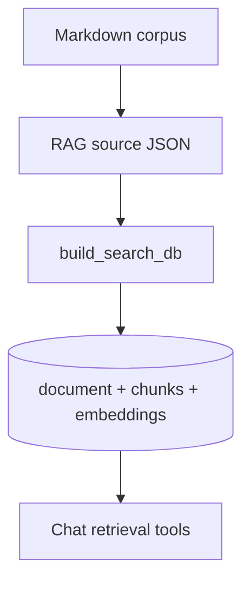

# RAG Data Pipeline

This backend ships with a repo-local Demo University Markdown corpus so build jobs never need external university source systems.

## Markdown corpus

The source Markdown lives under `app/rag/demo_corpus/` and includes:

- `website/pages/*.md`
- `website/programs/*.md`
- `catalog/pages/*.md`
- `catalog/programs/*.md`
- `catalog/courses/*.md`
- `training_materials/*.md`

Regenerate the RAG source JSON files without touching the database:

```bash
uv run -m app.rag.demo_corpus.generate
```

The generator writes the loader inputs under `app/rag/data/`:

- `website_pages.json` for website pages
- `website_programs.json` for website program pages
- `catalog_pages.json`
- `catalog_programs.json`
- `catalog_courses.json`
- `training_materials.json`

## Building the database

The normal build pipeline writes the Markdown corpus first, then chunks and embeds the documents:

```bash
uv run -m app.rag.cli sync
uv run -m app.rag.cli sync --force-rebuild
```

Direct build remains available and also refreshes the Markdown corpus before reading source JSON:

```bash
uv run -m app.rag.build
uv run -m app.rag.build --dry-run
```

## Order of operations

1. Write Demo University Markdown corpus (`demo_corpus.generate`)
2. Build or incrementally update the search database (`build_search_db`)
3. Refresh guardrail URL registries as part of the successful build

## Mermaid


